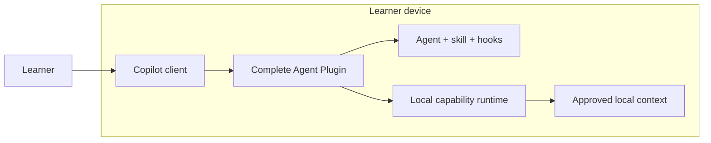
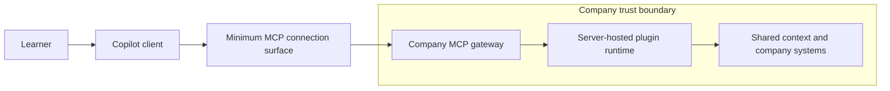
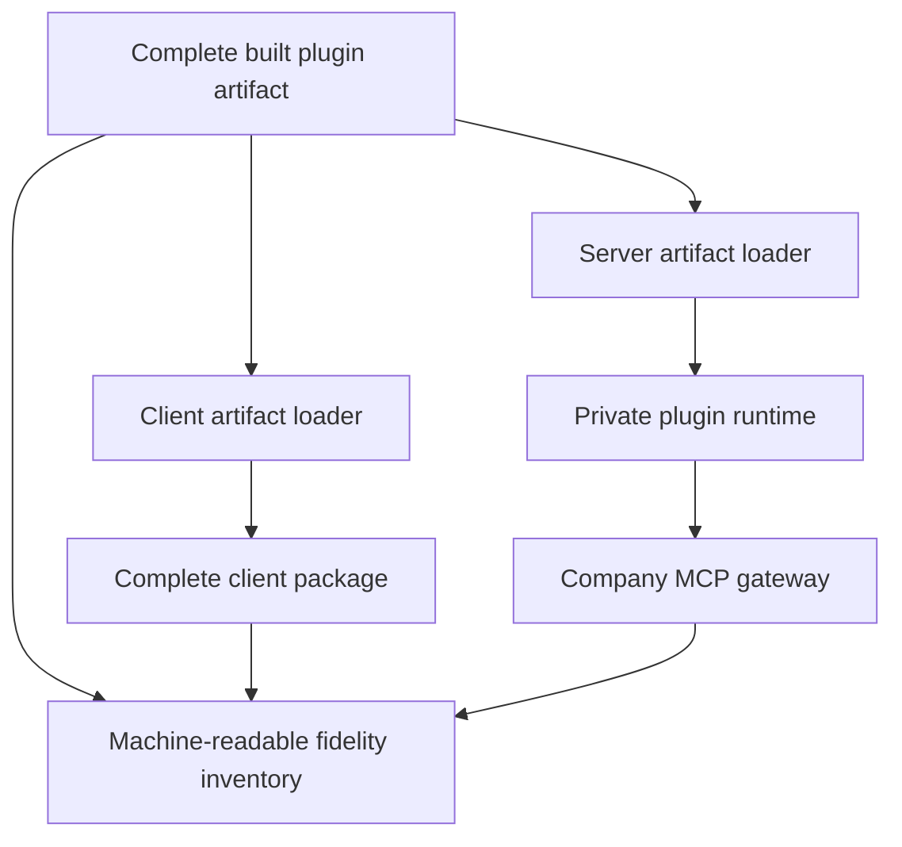

# Architecture

> This is a learning repository, not a production reference architecture.

## Placement topologies

The experiment compares two implementation topologies for one intended
capability. It does not assume that moving behind company MCP preserves every
Agent Plugin behavior.

### Complete client-hosted plugin

The learner owns package installation, runtime compatibility, updates, local
access, device availability, and local evidence.

### Server-hosted plugin behind company MCP

The company gateway owns authentication, authorization, policy, routing, rate
limits, and content-free operational telemetry. The plugin runtime behind it
owns the portable capability behavior and shared context access. The company
operator owns deployment, updates, availability, recovery, scaling, and cost.
The user still owns authentication, disclosure choices, and the decision to
trust or reject returned evidence.

## Capability mapping

`scripts/build-plugin.mjs` builds the executable artifact once. It copies that
artifact without recompilation to `plugins/local` and
`artifacts/plugin/runtime`. Both loaders verify `artifact.json`; the remote
connection contains only `mcp.json`, `plugin.json`, and
`server-artifact.json`. The gateway and runtime are forbidden from importing
`plugin-capability` or `todo-core` source.

The artifact also carries `capability/fidelity.json`, which records tool
behavior, agent intent, skill workflow, hook policy, context requirements,
approvals, errors, and telemetry. Every capability has one fidelity status:

- `native`;
- `mapped`;
- `companion-required`; or
- `unsupported`.

The hybrid topology is not assumed. It is selected only when a fidelity test
shows that valuable client-native behavior cannot cross MCP or when local and
offline context is a requirement.

## Executable boundaries

- `packages/plugin-capability` is compiled once into the plugin artifact.
- `packages/client-plugin-adapter` loads that artifact on the learner device.
- `packages/server-plugin-runtime` loads the same artifact from a non-public
  Container App.
- `packages/company-mcp-gateway` never imports plugin implementation code. It
  authenticates, applies boundary policy, proxies MCP, and emits content-free
  operational telemetry.
- `scripts/verify-artifact-reuse.mjs` proves byte identity and rejects source
  coupling.
