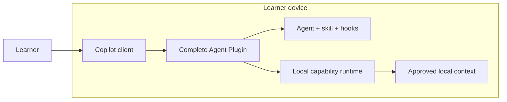
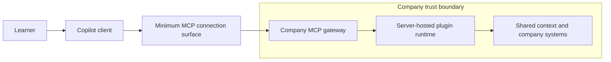
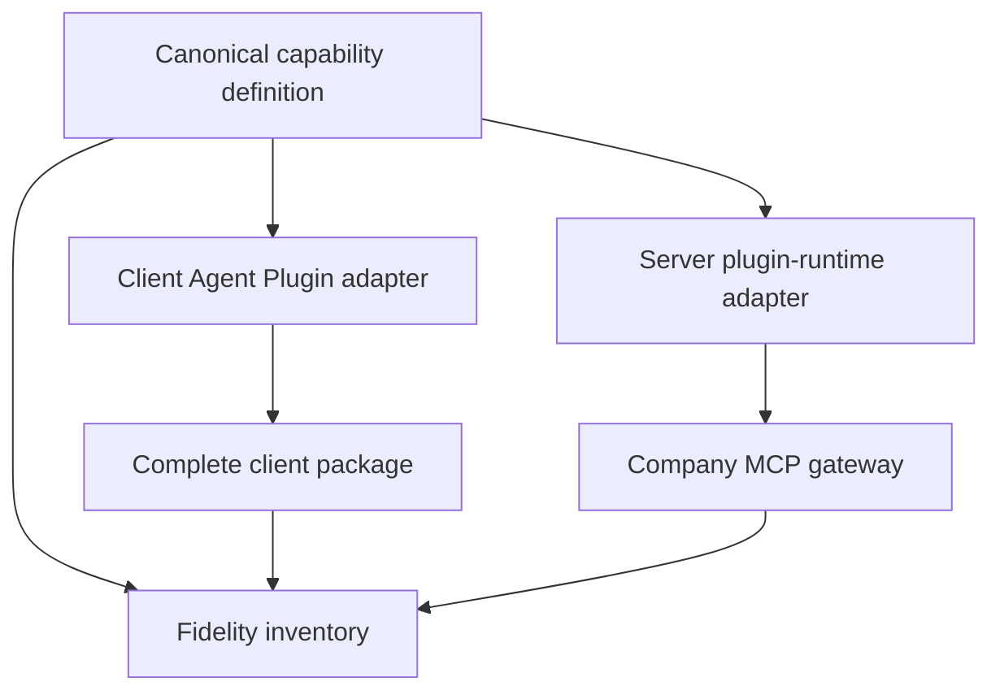

# Architecture

> This is a learning repository, not a production reference architecture.

## Placement topologies

The experiment compares two implementation topologies for one intended
capability. It does not assume that moving behind company MCP preserves every
Agent Plugin behavior.

### Complete client-hosted plugin

The learner owns package installation, runtime compatibility, updates, local
access, device availability, and local evidence.

### Server-hosted plugin behind company MCP

The company gateway owns authentication, authorization, policy, routing, rate
limits, and content-free operational telemetry. The plugin runtime behind it
owns the portable capability behavior and shared context access. The company
operator owns deployment, updates, availability, recovery, scaling, and cost.
The user still owns authentication, disclosure choices, and the decision to
trust or reject returned evidence.

## Capability mapping

The canonical capability definition records tool behavior, agent intent, skill
workflow, hook policy, context requirements, approvals, errors, and telemetry.
The adapters may produce different artifacts. Byte identity is not the target.
Every capability must instead receive one fidelity status:

- `native`;
- `mapped`;
- `companion-required`; or
- `unsupported`.

The hybrid topology is not assumed. It is selected only when a fidelity test
shows that valuable client-native behavior cannot cross MCP or when local and
offline context is a requirement.

## Implementation stages

The transport foundation builds one client plugin with local and remote MCP
bindings. Its custom agent, skill, and hooks remain client-side in those
transport exercises, and the HTTP adapter directly hosts the tools.

The placement stages add the canonical capability inventory, complete client
package, company MCP gateway, server-hosted plugin runtime, and
capability-fidelity report described in the
[implementation plan](implementation-plan.md). Together, the stages form one
lab and one evidence chain.
