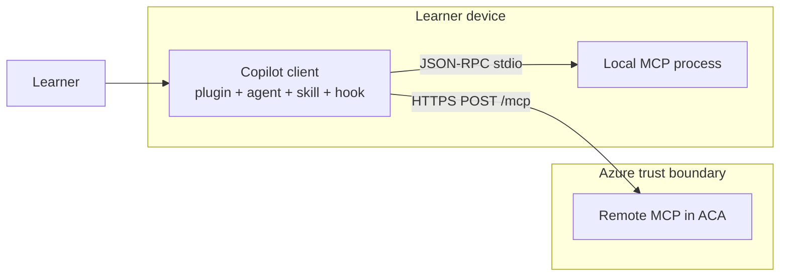
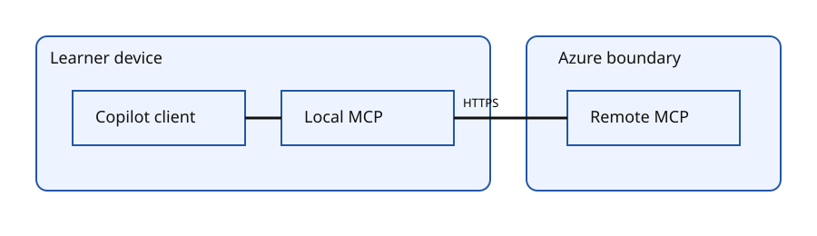
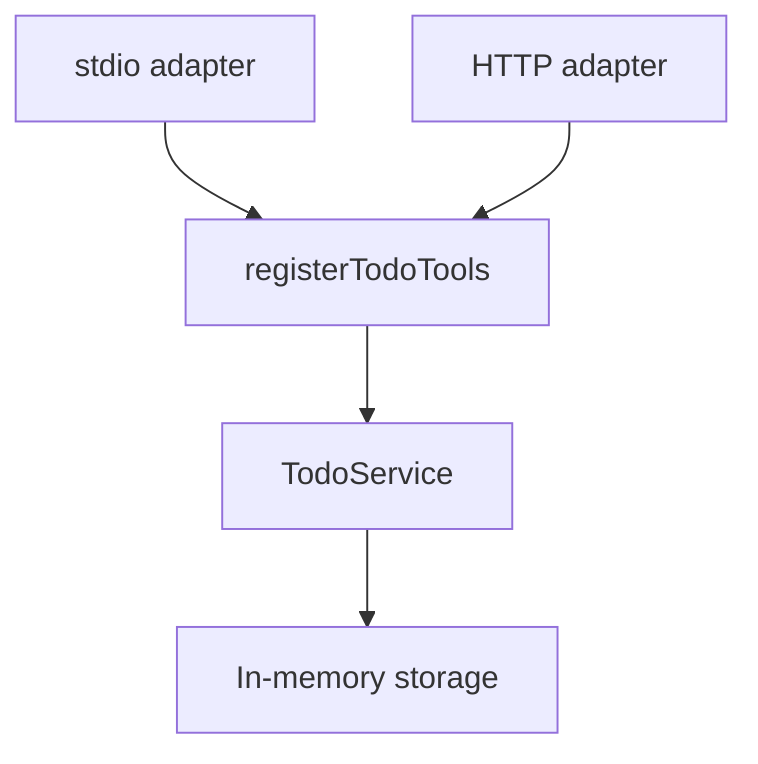
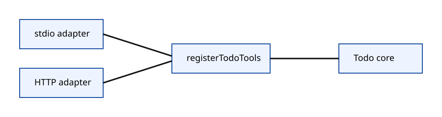
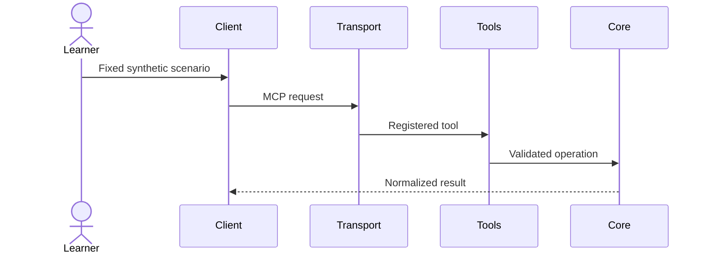
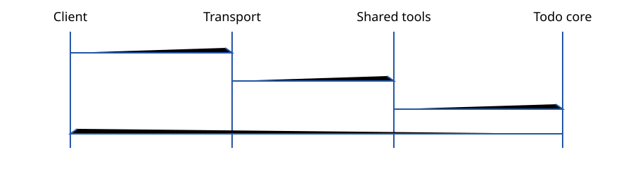

# Architecture

> This is a learning repository, not a production reference architecture.

The client boundary contains package discovery, agent instructions, the skill, and hooks. The local process is also on the learner device. The cloud boundary contains only the remote MCP adapter and its shared tool/domain code.

Both adapters call one registration factory, which calls one injected todo service. Core code has no MCP, HTTP, or process imports.

Each invocation follows the same logical sequence, with only the selected transport changing.

The external inventories under `artifacts/plugin-inventory/` prove all bundle files except `mcp.json` are byte-identical. Discovery exports prove the same five names, descriptions, and schemas are visible. The baseline fixes auth off, memory storage, one warm replica, seed, order, version, and machine; only the boundary differs.
