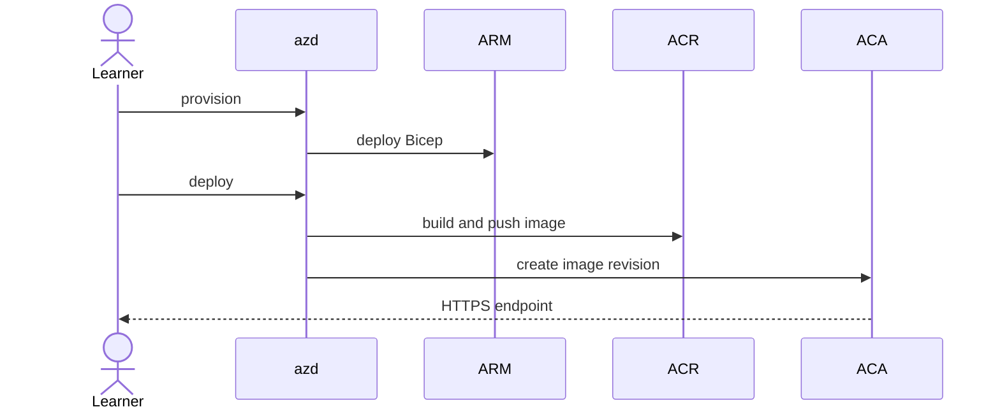

# Deployment

> This is a learning repository, not a production reference architecture. Provisioning requires separate authorization and creates billable Azure resources.

Deployment is separate from validation. `npm run check`, the default experiment, and the video workflow use fixture or `remote-test` loopback evidence and never prove or perform an ACA deployment. Only a manifest marked `live-aca` with deployed endpoint metadata may be described as ACA evidence.

`azd provision` deploys a Log Analytics workspace, managed Container Apps environment, ACR, user-assigned identity with AcrPull, and externally accessible Container App. Bicep owns configuration.

The `allowedOrigin` Bicep parameter defaults to `https://copilot.local` and is passed to the container as `ALLOWED_ORIGINS`. Bicep also fixes `STORAGE_MODE=memory` and `maxReplicas=1`; live evidence additionally requires the warm `minReplicas=1` profile. Keep origin validation enabled. If you override the parameter, use the exact same HTTPS origin as `EXPERIMENT_ORIGIN` when running live evidence.

Authentication is optional. The `mcpBearerToken` Bicep parameter is secure, becomes an ACA secret, and reaches the container only through an `MCP_BEARER_TOKEN` secret reference. Do not use `azd env set` for this value or print it. Store the value in Key Vault, then configure its reference interactively:

```powershell
azd env set-secret MCP_BEARER_TOKEN
```

Follow the prompt to select the authorized Key Vault secret. Provisioning has no token output. Use the same secret value only in the local process environment while running the authentication cell, then remove it.

```powershell
azd auth login
azd env new copilot-mcp-lab
azd provision
azd deploy
azd env get-values
```




Verify `GET /healthz` and `GET /readyz`, inspect console/system logs by correlation ID only, and never log request content. Use the warm profile (`minReplicas=1`) for runnable baseline and authentication cells. Cold-profile measurements remain a manual follow-on until a distinct runner execution path is implemented. Then follow [cleanup](cleanup-and-cost.md).
