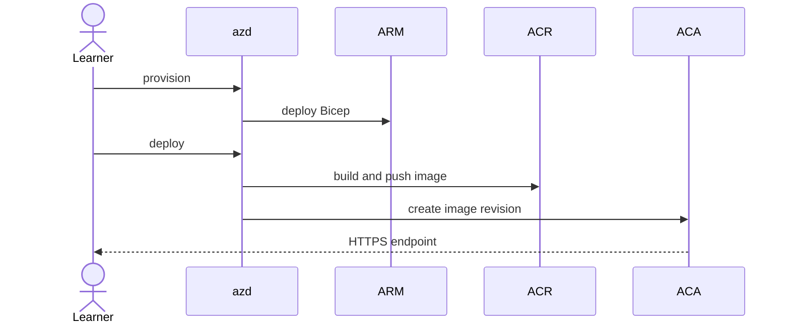

# Deployment

> This is a learning repository, not a production reference architecture. Provisioning requires separate authorization and creates billable Azure resources.

`azd provision` deploys a Log Analytics workspace, managed Container Apps environment, ACR, user-assigned identity with AcrPull, and externally accessible Container App. Bicep owns configuration.

```powershell
azd auth login
azd env new copilot-mcp-lab
azd provision
azd deploy
azd env get-values
```




Verify `GET /healthz` and `GET /readyz`, inspect console/system logs by correlation ID only, and never log request content. Use the warm profile (`minReplicas=1`) for baseline and cold profile (`minReplicas=0`) only in its separate cell. Then follow [cleanup](cleanup-and-cost.md).
