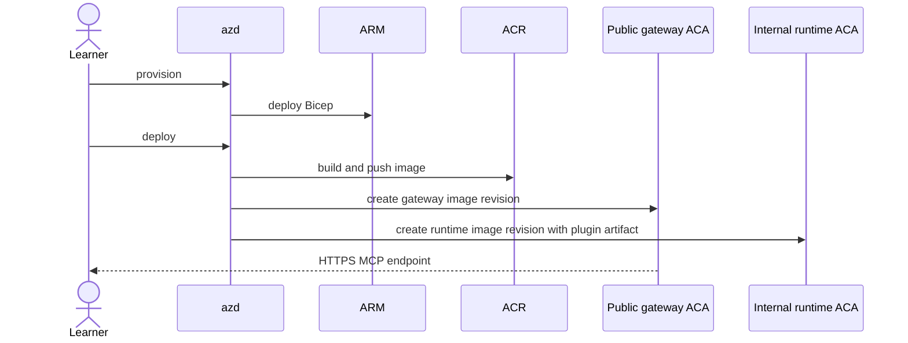
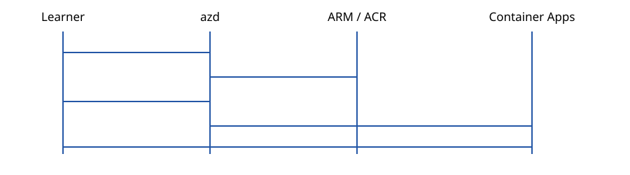

# Deployment

> This is a learning repository, not a production reference architecture. Provisioning requires separate authorization and creates billable Azure resources.

Deployment is separate from validation. `npm run check`, the default experiment, and the video workflow use fixture or `remote-test` loopback evidence and never prove or perform an ACA deployment. Only a manifest marked `live-aca` with deployed endpoint metadata may be described as ACA evidence.

The deployment stage uses two distinct components: a public representative
company MCP gateway and a non-public server-hosted plugin runtime behind it.
The two services are built from separate Dockerfiles and use distinct managed
identities.

## Company-layer deployment

| Component                 | Target responsibility                                                                                     |
| ------------------------- | --------------------------------------------------------------------------------------------------------- |
| Company MCP gateway       | Public MCP endpoint, identity, authorization, policy, routing, rate limits, and content-free telemetry    |
| Server plugin runtime     | Loads the complete built plugin artifact, executes its portable capability, and reports its artifact hash |
| Client connection surface | Endpoint and authentication configuration only, plus a thin companion if fidelity tests require one       |

The gateway must be the only public path to the runtime. Direct runtime access
must fail. Azure evidence must bind both components, their identities, images,
revisions, ingress modes, policy profile, region, scaling, and cleanup result.

## What deployment adds to the experiment

The local and loopback labs prove package, protocol, and behavior parity. ACA
adds the real operational boundary:

| Added component                    | Learning value                                                         |
| ---------------------------------- | ---------------------------------------------------------------------- |
| External HTTPS ingress             | Observe DNS, TLS, Origin, and network failures                         |
| Managed Container Apps environment | Separate the server lifecycle from the client                          |
| ACR and managed identity           | Deploy one centrally managed server image without registry credentials |
| Log Analytics                      | Correlate content-free request telemetry across a shared service       |
| Replica controls                   | Keep the warm baseline stable, then study cold start separately        |
| Optional bearer secret             | Measure authentication in a distinct experiment cell                   |
| Operator-governed context boundary | Study provenance, freshness, authorization, retention, and user trust  |

`azd provision` deploys a Log Analytics workspace, managed Container Apps
environment, ACR, two user-assigned identities with AcrPull, an externally
accessible gateway Container App, and an internal-ingress runtime Container
App. Bicep owns configuration.

The `allowedOrigin` Bicep parameter defaults to `https://copilot.local` and is
passed only to the gateway as `ALLOWED_ORIGINS`. Bicep sets `maxReplicas=1` on
both components; live evidence additionally requires the warm `minReplicas=1`
profile. The gateway receives the runtime's internal FQDN through
`PLUGIN_RUNTIME_URL`. Keep origin validation enabled.

Authentication is optional. The `mcpBearerToken` Bicep parameter is secure, becomes an ACA secret, and reaches the container only through an `MCP_BEARER_TOKEN` secret reference. Do not use `azd env set` for this value or print it. Store the value in Key Vault, then configure its reference interactively:

```powershell
azd env set-secret MCP_BEARER_TOKEN
```

Follow the prompt to select the authorized Key Vault secret. Provisioning has no token output. Use the same secret value only in the local process environment while running the authentication cell, then remove it.

```powershell
azd auth login
azd env new copilot-mcp-lab
azd provision
azd deploy
azd env get-values
```

After deployment, `azd env get-values` exposes nonsecret evidence handoff
values:

- `ACA_RESOURCE_GROUP`
- `ACA_GATEWAY_APP_NAME`
- `ACA_RUNTIME_APP_NAME`
- `MCP_ENDPOINT_URL`
- `PLUGIN_RUNTIME_INTERNAL_FQDN`
- `EXPERIMENT_ORIGIN`
- `EXPERIMENT_SCALING_PROFILE`
- `EXPERIMENT_STORAGE_MODE`

Use those values with the authorized `live-aca` runner. The runner queries the
actual Container App and rejects mismatched endpoint, revision, image, Origin,
auth, storage, or replica controls.





Verify `GET /healthz` and `GET /readyz`, inspect console/system logs by correlation ID only, and never log request content. Use the warm profile (`minReplicas=1`) for runnable baseline and authentication cells. Cold-profile measurements remain a manual follow-on until a distinct runner execution path is implemented. Then follow [cleanup](cleanup-and-cost.md).

The company-layer deployment moves the portable capability runtime behind the
company MCP gateway while recording client-native behavior that remains in a
thin companion. A production version would require the operator to own:

- source authorization and tenant isolation;
- evidence freshness and provenance;
- service patching, availability, recovery, and scaling;
- retention, deletion, telemetry minimization, and cost;
- a way for users to inspect why a recommendation was made.

The user still owns authentication, the decision to disclose context, and the
decision to trust or reject the returned evidence.

## Deployment checkpoint

Before accepting live evidence, explain:

1. How the identical `capability.js` SHA-256 in the local client and private
   runtime proves artifact reuse without source imports.
1. Why `minReplicas=1`, `maxReplicas=1`, and memory storage are required for
   the warm baseline.
1. Which new costs and failure modes are absent from the local run.
1. Which context-governance responsibilities transfer from the learner to the
   service operator, and which remain with the learner.
1. Why deleting the resource group is part of completing the lab.
