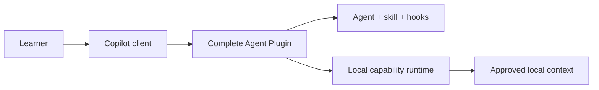
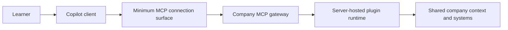

# Put a plugin behind a company MCP layer

## Problem statement

The current lab compares one client-installed Agent Plugin whose MCP tools run
over local stdio or remote Streamable HTTP. That proves transport, discovery,
and domain parity, but it does not answer the intended architecture question:

> What do I gain and lose if I stop distributing the complete plugin to every
> client and instead run it behind my company's MCP layer?

The existing byte-identity invariant keeps the custom agent, skill, hooks, and
orchestration in the client. It therefore assumes away the capability-fidelity,
governance, and responsibility tradeoffs that the lab needs to expose.

## Proposed architecture

Build one portable capability definition and execute it through two distinct
topologies.

### Topology A: complete client-hosted plugin

The learner installs a complete Agent Plugin package. The package contains the
custom agent, skill, hooks, tool contract, orchestration rules, and a local
runtime. The client and learner device own execution, approved local context,
updates, availability, and local evidence.

### Topology B: plugin runtime behind company MCP

The client connects to the company MCP layer. The company layer authenticates,
authorizes, applies policy, records content-free operational evidence, and
routes the request to a server-hosted plugin runtime. The complete portable
capability executes behind that boundary.

The remote topology must not assume that every client-native Agent Plugin
feature can cross MCP. The implementation must classify each feature as:

- **portable unchanged**;
- **mapped to an MCP primitive or company-layer contract**;
- **requires a thin client companion**; or
- **not preserved**.

That classification is an experiment result, not a prerequisite.

### Shared capability source

Create a canonical capability source that describes:

- tool names, schemas, and domain behavior;
- agent intent and decision rules;
- skill workflow;
- pre/post execution policies currently represented by hooks;
- context requirements and provenance;
- approval and error behavior.

Generate or adapt that source into:

1. the complete client Agent Plugin package; and
2. the server-hosted plugin runtime consumed behind the company MCP gateway.

Do not require the generated artifacts to be byte-identical. Require a
traceable mapping from every canonical capability to its realization and
fidelity status in each topology.

## What changes

| Current implementation                                         | Required change                                                                                                                    |
| -------------------------------------------------------------- | ---------------------------------------------------------------------------------------------------------------------------------- |
| Local and remote packages are byte-identical except `mcp.json` | Replace byte identity as the primary invariant with a capability inventory and fidelity report                                     |
| Agent, skill, and hooks always remain in the client            | Implement a server-hosted runtime for their portable behavior and identify what still needs a client companion                     |
| Remote HTTP adapter is the remote product boundary             | Insert an explicit company MCP gateway in front of the plugin runtime                                                              |
| Parity means identical tool discovery and todo state           | Expand parity to task outcome, instructions, workflow, policy, approvals, context use, errors, and evidence                        |
| Latency is the main measured difference                        | Make capability fidelity, governance, trust, and responsibility transfer the primary results; retain latency as one secondary cost |
| Context study is selected by transport                         | Source context through explicit local and company providers so context placement is independent of transport                       |
| One ACA service hosts the MCP adapter and tools                | Plan separate gateway and internal plugin-runtime components, even if a local test profile runs both in one process                |

## What stays the same

- TypeScript workspace and simple synthetic todo domain.
- Secure-by-default learning posture and non-production disclaimer.
- No real company data, credentials, prompts, or proprietary MCP contracts.
- Local stdio and Streamable HTTP protocol tests as lower-level evidence.
- Azure Container Apps and `azd` for an optional, explicitly authorized live
  deployment.
- Deterministic fixtures, auditable manifests, sanitized telemetry, Playwright
  learning videos, and cleanup controls.

## Implementation plan

### Wave 0: freeze the transport prototype

**Output:** Label the current stdio/HTTP implementation as a lower-level
transport baseline, not the answer to the company-MCP decision.

**Validation:** Docs and tests no longer claim byte-identical packages prove
plugin-placement parity.

### Wave 1: define the capability inventory

**Output:**

- Add `packages/plugin-capability/` as the canonical source.
- Inventory agent behavior, skill steps, hook policies, tools, context,
  approvals, errors, and telemetry.
- Add a machine-readable fidelity schema with statuses `native`, `mapped`,
  `companion-required`, and `unsupported`.

**Validation:** Every current plugin feature has an owner, source path,
expected outcome, and topology mapping.

### Wave 2: build the complete client-hosted reference

**Output:**

- Generate the installable client package from `plugin-capability`.
- Keep the local runtime, agent, skill, hooks, and approved local context on
  the learner device.
- Capture task outcomes and client-native lifecycle evidence.

**Validation:** A clean client profile can install, run, inspect, and uninstall
the complete package without the company gateway.

### Wave 3: build the company MCP boundary

**Output:**

- Add `packages/company-mcp-gateway/` for identity, authorization, routing,
  policy, rate limits, Origin controls, and content-free telemetry.
- Add `packages/server-plugin-runtime/` behind the gateway.
- Keep the runtime unreachable from the public client except through the
  gateway.
- Add explicit local fixtures for company identity, policy, and shared context.

**Validation:** Direct runtime access fails; authorized gateway requests reach
the runtime; unauthorized and cross-tenant fixtures fail closed.

### Wave 4: map plugin behavior into the server runtime

**Output:**

- Execute portable agent instructions and skill workflow in the server runtime.
- Map hook intent to gateway/runtime policy where semantically valid.
- Record any behavior that requires a thin client companion or cannot be
  represented.
- Add a minimal companion profile only for capabilities proven to require it.

**Validation:** Fidelity tests produce an explicit result for every capability;
no missing feature silently passes.

### Wave 5: run the decision experiment

**Output:** Compare client-hosted, server-hosted-behind-MCP, and hybrid
topologies using the same synthetic task and evidence rubric.

Measure:

- task outcome and explanation quality;
- context availability and provenance;
- client-native behavior retained or lost;
- approval and failure experience;
- update and rollback path;
- identity and authorization ownership;
- offline behavior and network dependency;
- observability, blast radius, scaling, latency, and cost;
- user and company operator responsibilities.

**Validation:** Produce a decision scorecard that recommends client, server, or
hybrid from explicit evidence rather than a transport preference.

### Wave 6: deploy the representative company layer

**Output:** Use `azd` and Bicep to deploy an externally reachable gateway and
an internal plugin runtime to Azure Container Apps.

**Validation:** Azure evidence binds the gateway endpoint, internal runtime,
images, revisions, identity, policy profile, region, scaling, and cleanup
result. No deployment occurs without separate authorization.

### Wave 7: update the learning experience

**Output:** Rewrite the guided lab, architecture diagrams, responsibility
matrix, videos, and troubleshooting around the placement decision.

**Validation:** A learner can defend one of three decisions—client, server
behind company MCP, or hybrid—and cite capability-fidelity and responsibility
evidence.

## Decision scorecard

| Question                                                                    | Favors client-hosted          | Favors server behind company MCP | Favors hybrid                     |
| --------------------------------------------------------------------------- | ----------------------------- | -------------------------------- | --------------------------------- |
| Does the capability require private local files, processes, or offline use? | Yes                           | No                               | Some tasks                        |
| Does it require shared company systems or centrally governed context?       | No                            | Yes                              | Both context types                |
| Must client-native agents, skills, hooks, or approvals remain exact?        | Yes                           | Only if faithfully mapped        | Some must remain local            |
| Are centralized updates, policy, and audit required?                        | Low priority                  | High priority                    | Central core with local UX        |
| Can users tolerate network and company-layer outages?                       | No                            | Yes                              | Graceful local subset needed      |
| Who can operate identity, uptime, scaling, telemetry, and cost?             | Individual/team client owners | Company platform operator        | Shared ownership is explicit      |
| Is one shared failure domain acceptable?                                    | No                            | Yes                              | Partition critical local behavior |

## Key decisions needed

### 1. Canonical capability model

**Recommendation:** Define a repository-owned portable capability schema and
adapters rather than treating the Agent Plugin package itself as portable.

**Alternative:** Load the client package directly on the server.

**Rationale:** Client package fields may depend on client-native behavior. An
explicit schema makes unsupported mappings visible instead of pretending they
execute remotely.

### 2. Company MCP representation

**Recommendation:** Implement a representative open gateway contract with
synthetic identity and policy fixtures.

**Alternative:** Integrate a proprietary company MCP layer.

**Rationale:** The public learning repository must not depend on confidential
contracts or company infrastructure.

### 3. Remote client shape

**Recommendation:** Start with a pure MCP connection, then add a thin companion
only for capabilities that fidelity tests prove cannot cross the boundary.

**Alternative:** Ship a companion from the beginning.

**Rationale:** Starting thin makes the experiment reveal the actual minimum
client requirement.

## Risks and mitigations

### Risk: the phrase “entire plugin on the server” overstates platform support

- **Likelihood:** High
- **Impact:** High
- **Mitigation:** Use the capability inventory to distinguish portable
  behavior from client-native packaging. Never claim unsupported hooks, agents,
  or skills execute remotely.

### Risk: the simulated gateway teaches proprietary company behavior

- **Likelihood:** Medium
- **Impact:** High
- **Mitigation:** Use only public MCP primitives and documented, synthetic
  gateway responsibilities. Label company-specific integration as out of
  scope.

### Risk: outcome parity hides lost interaction quality

- **Likelihood:** Medium
- **Impact:** High
- **Mitigation:** Test instructions, approvals, errors, provenance, recovery,
  and explanation quality in addition to final todo state.

### Risk: hybrid becomes the automatic answer

- **Likelihood:** Medium
- **Impact:** Medium
- **Mitigation:** Require every retained client component to cite a failed
  fidelity test or a local/offline requirement.

## Scope

### In v1

- Synthetic capability inventory and fidelity report.
- Complete client-hosted implementation.
- Representative company MCP gateway.
- Server-hosted plugin runtime behind the gateway.
- Optional thin companion discovered through evidence.
- Client/server/hybrid decision scorecard.
- Local automated evidence and optional authorized ACA deployment.

### Deferred

- Proprietary company MCP integration.
- Production tenant isolation, compliance certification, and enterprise SLA.
- Real company data or identity.
- Universal support claims for all Agent Plugin hosts.

## Success criteria

The redesigned lab is complete when:

1. the client-hosted topology runs the complete plugin capability;
1. the remote topology reaches a server-hosted plugin runtime only through the
   representative company MCP gateway;
1. every agent, skill, hook, tool, context, and approval behavior has a
   recorded fidelity status;
1. tests fail when a capability disappears without an explicit unsupported or
   companion-required result;
1. the learner can compare client, server, and hybrid responsibility models;
1. videos demonstrate capability fidelity and responsibility transfer, not
   only transport;
1. the final worksheet produces a defensible placement decision.
